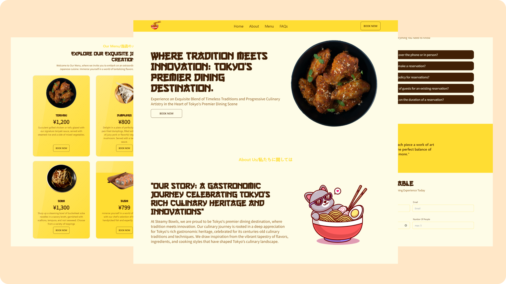

# Steamy Bowls

Steamy Bowls is a fully responsive website that showcases the menu, location, and Form information of a fictional Japanese restaurant. The project utilizes modern web development technologies to provide an immersive and visually appealing user experience.

## Screenshot

## Demo

### Built with

- React
- Tailwind CSS
- Javascript
- DaisyUI
- React Hook Form

